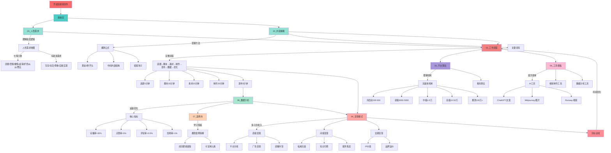

# 短视频赚钱工作流知识库

## 📚 目录结构

```
short_video_workflow/
├── 01_人性需求/           # 人性底层逻辑与需求分析
├── 02_内容策略/           # 选题、脚本、爆款公式
├── 03_工作流程/           # 从选题到发布的完整流程
├── 04_变现模式/           # 各类变现路径与策略
├── 05_平台算法/           # 各平台推荐机制解析
├── 06_工具模板/           # 自动化工具与模板库
├── 07_案例库/             # 成功案例拆解
├── 08_数据分析/           # 数据追踪与优化方法
└── README.md              # 本文件
```

## 🎯 核心理念

**可持续赚钱 = 人性洞察 × 高效工作流 × 数据驱动迭代**

## 🗺️ 知识图谱



### 知识图谱说明

#### 📊 学习路径
```
新手路径: 人性需求 → 内容策略 → 工作流程 → 开始实践
进阶路径: 平台算法 → 工具模板 → 数据分析 → 优化迭代
高级路径: 案例拆解 → 变现模式 → IP构建 → 规模化
```

#### 🎯 核心模块关系
```
人性需求 ────┐
            ├──→ 内容策略 ──→ 工作流程 ──→ 数据分析 ──→ 优化迭代
平台算法 ────┘                    │
                                  ↓
工具模板 ────────────────────→ 变现模式 ──→ 持续收益
                                  ↑
案例库 ──────────────────────────┘
```

#### 💡 关键节点
- **人性需求**: 理解用户底层需求，是内容创作的根基
- **内容策略**: 掌握爆款公式，提高内容质量
- **工作流程**: 标准化流程，提升生产效率
- **平台算法**: 理解推荐机制，获取更多流量
- **数据分析**: 数据驱动决策，持续优化
- **变现模式**: 多元化收入，实现商业价值

## 🚀 快速开始

### 新手路径
1. 阅读 `01_人性需求/人性需求地图.md` - 理解底层逻辑
2. 学习 `02_内容策略/爆款公式.md` - 掌握内容方法
3. 使用 `06_工具模板/选题生成器.md` - 开始实践

### 进阶路径
1. 研究 `05_平台算法/` - 理解流量分发机制
2. 优化 `03_工作流程/自动化流程.md` - 提升效率
3. 拓展 `04_变现模式/` - 多元化收入

### 高级路径
1. 分析 `07_案例库/` - 拆解成功案例
2. 应用 `08_数据分析/` - 建立数据体系
3. 构建自己的IP矩阵

## 📖 使用说明

- **每个目录**都包含独立的知识点文档
- **模板文件**可直接复制使用
- **案例分析**提供实战参考
- **定期更新**最新趋势和方法

## 🔄 更新日志

- 2025-10-17: 初始化知识库结构
- 待补充...

## 💡 贡献指南

随着实践积累，持续更新：
- 新的爆款案例
- 优化的工作流程
- 有效的变现方法
- 最新的平台规则

---

**记住：知识只有应用才有价值，立即开始行动！**
